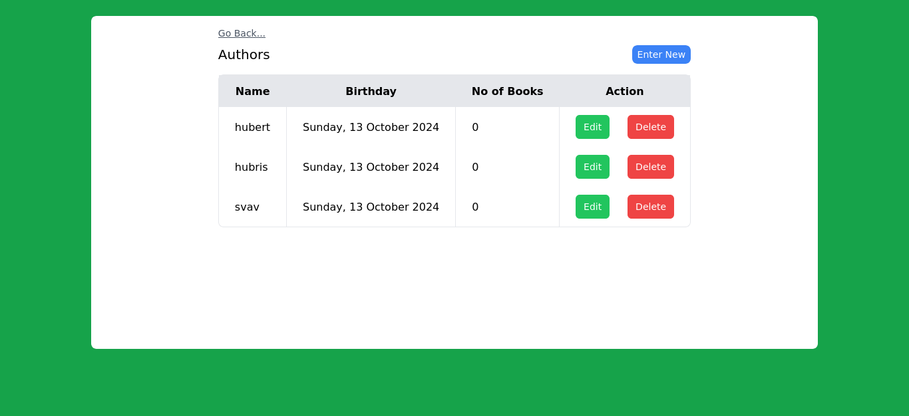
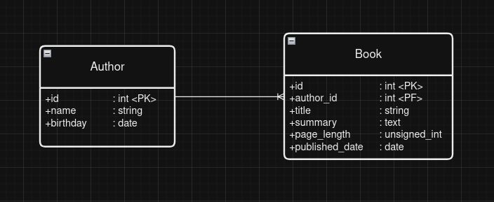

# dot-api
Aplikasi manajemen data yang disertai admin panel.

# desain database

Database aplikasi terdiri dari dua table:
- Books
- Authors
Satu author menulis banyak buku (one-to-many relationship)

# dependency
Framework: Laravel
Additional deps: loilo/fuse (fuzzy searching)
